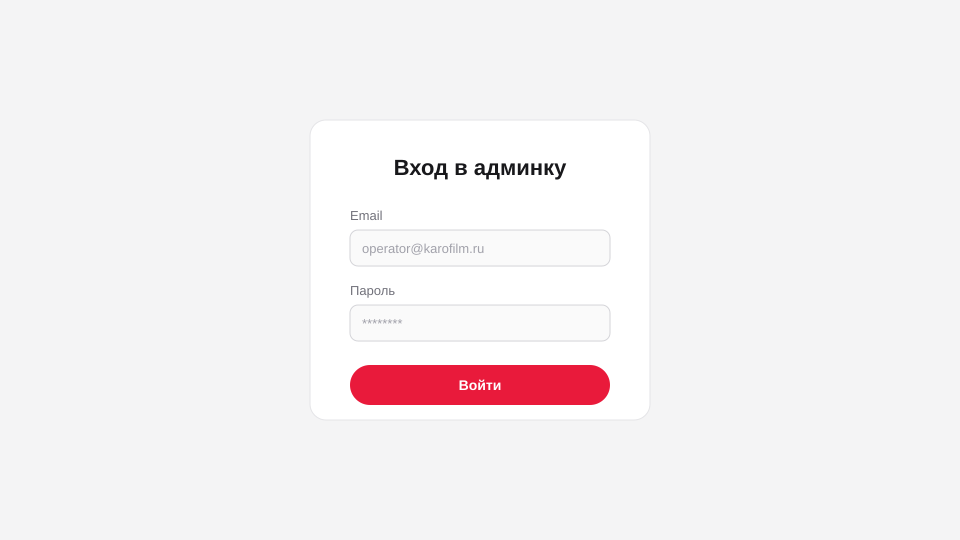
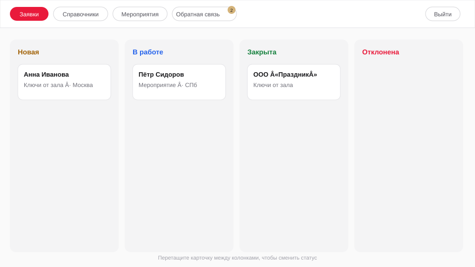
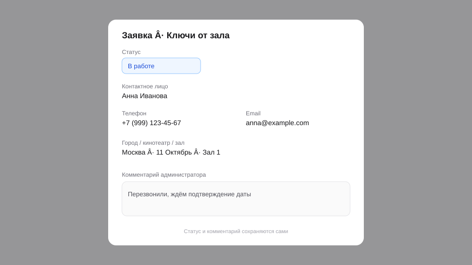
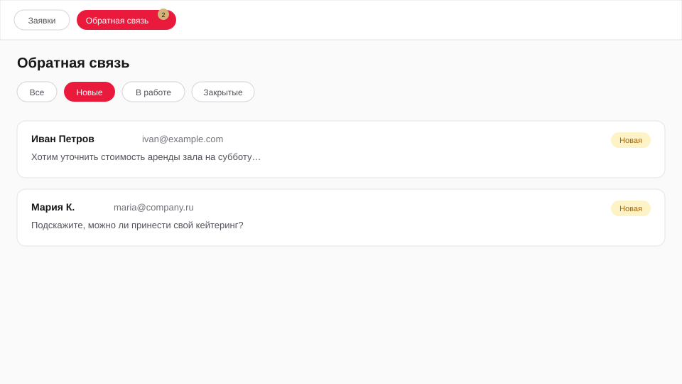

# Инструкция для операторов КАРО Event

PDF в админке: кнопка **Инструкция** (рядом с «Выйти») → `/docs/operator-guide.pdf`.

Админка сайта заявок: [https://event.karofilm.ru/admin](https://event.karofilm.ru/admin)

Учётную запись выдаёт администратор. Логин — ваш рабочий email, пароль сообщают отдельно.

---

## 1. Вход

1. Откройте [https://event.karofilm.ru/admin/login](https://event.karofilm.ru/admin/login).
2. Введите email и пароль → **Войти**.
3. Сессия действует около **12 часов**. В конце работы нажмите **Выйти**.

---

## 2. Заявки (основной экран)

Раздел **Заявки** — канбан с колонками:

| Колонка | Значение |
|--------|----------|
| **Новая** | Только что с сайта, ещё не взяли |
| **В работе** | Связались / уточняете детали |
| **Закрыта** | Сделка закрыта / зал сдан |
| **Отклонена** | Не подходит / отказ клиента |

### Как работать

1. Смотрите колонку **Новая**.
2. **Сменить статус** — перетащите карточку в другую колонку **или** откройте карточку и выберите статус в списке.
3. **Открыть карточку** — клик по заявке.
4. При необходимости фильтруйте продукт: «Ключи от зала» / «Групповой билет» / «Мероприятие в КАРО».

### Карточка заявки

- **Статус** и **комментарий администратора** сохраняются сами (после смены / ухода с поля).
- Поля с карандашом ✎ (контакты, город, зал, дата и т.д.) — можно поправить, если клиент ошибся.
- Стоимость и вместимость зала — только для просмотра.
- Удалять заявки может только администратор.

**Письмо «Открыть в админке»** сразу открывает нужную карточку — удобно брать заявку из почты.

---

## 3. Обратная связь

Отдельная очередь сообщений со страницы «Обратная связь» на сайте (не путать с заявками на аренду).

1. В меню — **Обратная связь** (рядом может быть бейдж с числом новых).
2. Фильтры: Все / Новые / В работе / Закрытые.
3. Откройте строку → ответьте клиенту **по email/телефону** (из админки письмо клиенту само не уходит при смене статуса).
4. Поставьте статус и при необходимости внутренний комментарий.

---

## 4. Справочники и мероприятия

Оператору доступны:

- **Справочники** — форматы залов, кинотеатры, залы и цены аренды (пн–чт / пт–вс).
- **Мероприятия** — тексты блока на главной странице сайта.

Удаление записей в справочниках — только у администратора. Если кнопка «Удалить» вернула ошибку — это нормально для роли оператора.

Раздел **Пользователи** оператору не показывается.

---

## 5. Уведомления на почту

Письма о новых заявках / обратной связи приходят на ваш email, только если администратор включил галочки в вашей карточке пользователя:

- Ключи от зала  
- Мероприятие в КАРО  
- Обратная связь  

Самостоятельно галочки включить нельзя — напишите администратору.

---

## 6. Типовой день

1. Войти в админку.
2. Разобрать **Новые** заявки → перенести **В работу**, уточнить детали в карточке.
3. Проверить **Обратную связь** по бейджу.
4. Закрыть или отклонить обработанные.
5. **Выйти**.

---

## Быстрые ссылки

| Что | URL |
|-----|-----|
| Вход | https://event.karofilm.ru/admin/login |
| Заявки | https://event.karofilm.ru/admin |
| Обратная связь | https://event.karofilm.ru/admin/feedback |
| Справочники | https://event.karofilm.ru/admin/catalogs |
| Сайт | https://event.karofilm.ru |

При сбое входа или пропавших письмах — к администратору сайта / IT.
